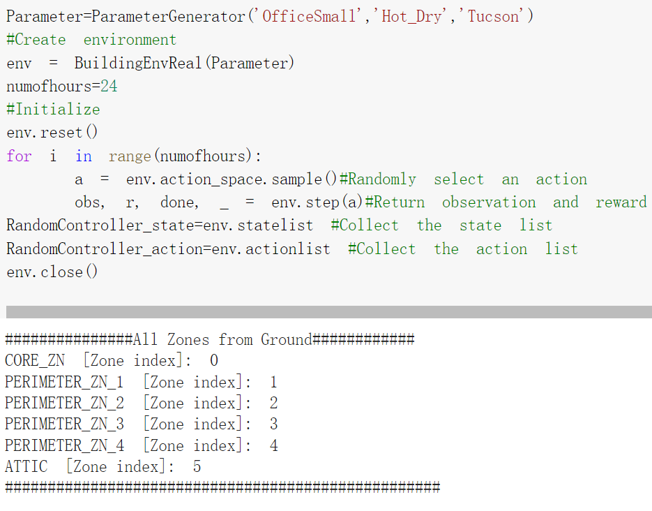
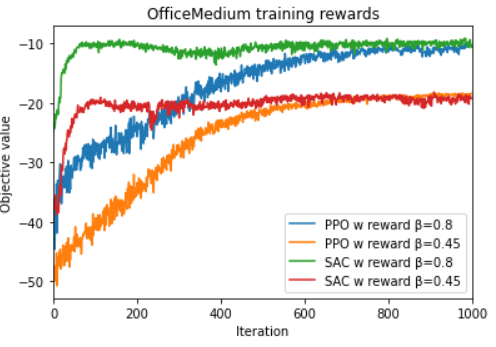
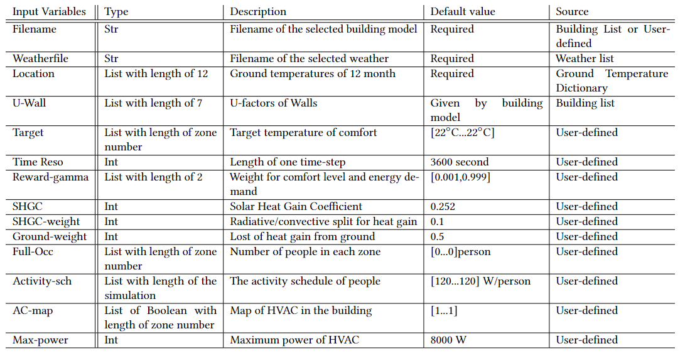
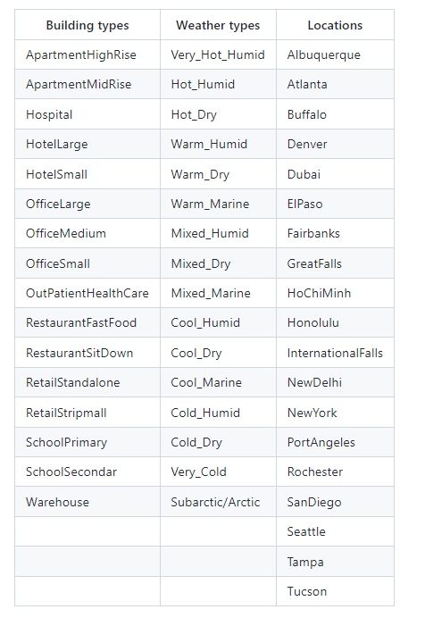
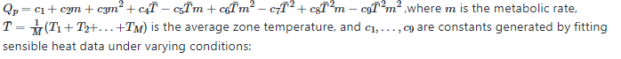
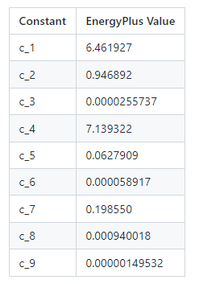

<p align="left">
  
</p>

# BEAR
*Physics-Principled Building Environment for Control and Reinforcement Learning*

Authors: Chi Zhang, Yuanyuan Shi and Yize Chen

University of California San Diego, Hong Kong University of Science and Technology

GitHub Homepage: [**BEAR**](https://drive.google.com/file/d/1waRMSn92azFNuRoMSylkwgEDk1CpIz2c/view?usp=sharing).

Thank you for choosing BEAR.

BEAR is a physics-based **B**uilding **E**nvironment for Control **A**nd **R**einforcement Learning. The platform is intended for building dynamics modeling and building energy management, and it allows researchers to efficiently benchmark both model-based and model-free (Reinforcement Learning) controllers using a broad collection of standard building models in Python without the need of co-simulation using other building simulators. For implementation convenience, three elements (building type, weather type, and city) can be selected by users to create a customized environment. You can read the detailed presentation of BEAR in our paper:

*Zhang, C., Shi, Y., & Chen, Y. (2022). [**BEAR: Physics-Principled Building Environment for Control and Reinforcement Learning**](https://dl.acm.org/doi/abs/10.1145/3575813.3576877) 14th ACM International Conference on Future Energy Systems (e-Energy). 2023, arXiv. https://doi.org/10.48550/arXiv.2211.14744*
## Usage example
Two examples "QuickStart" and "CustomizeModel_example" are provided for demonstration in Google Colab. Try it out [**HERE**.](https://drive.google.com/drive/folders/1-pFR1-RfhM8UiN2fmBra883NlP1RF1Qj?usp=sharing)

*Quick reminder: Download the folder "BEAR" and upload it to your Drive in "My Drive", then run the cells.*
## Manual Installation

To manually install BEAR, please follow the steps below:

1. **Clone the Repository**

    Clone the BEAR repository to your local machine:
    ```
    git clone https://github.com/chz056/BEAR.git
    ```

2. **Navigate to the Cloned Directory**

    Change directory to the cloned repository:
    ```
    cd BEAR
    ```
    
3. **Install Requirements**
    (Optional) If you plan to use a virtual environment, you can create one using:
    ```
    python -m pip install virtualenv
    python -m venv myenv
    source myenv/Scripts/activate # on unix-like systems
    ```
    Install the required Python packages using pip:
    ```
    pip install -r requirements.txt
    ```


4. **Run the Main Script**

    Now, you can run the quickstart.py script to start using BEAR:
    ```
    python quickstart.py
    ```

And that's it! You've successfully installed and set up BEAR on your local machine.

Please report any issues with installation or bugs in the code in the [Issues section](https://github.com/chz056/BEAR/issues).

## Functionalities
The main functionalities of **BEAR** are the following :
  - **Create environment**
  <div align="center">
  <br><br>
  </div>
  
  - **Building model**
  <div align="center">
  <br><br>
  </div>

  - **RL testbed**
  <div align="left">
  <br><br>
  </div>
  
### Environment Variables
BEAR supports a set of user-defined variables as inputs and provides an OpenAI Gym interface. Here is a table of all settings that users could modify:
<div align="center">
  <br><br>
</div>

### Buildings
For creating a large variety of building models, BEAR includes 16 different types of building at 19 locations. Here are lists of available buildings, weathers, and locations:
<div align="center">
  <br><br>
</div>

### RL algorithms
Researchers from the machine learning and reinforcement learning community can design new environments and algorithms with minimal knowledge of the underlying dynamics and models and thus can focus more on algorithm development and evaluation. BEAR provides an OpenAI Gym interface. Users can perform simulations in the customized environment with any classic model-based control or learning-based controllers. Examples are shown in the google colab notebook.
 
### Simplifications
BEAR enables an automated pipeline to process building geometry, weather and occupancy information to a composable RL environment. Compared to the actual building model, our model makes several simplifications regarding the zone shape, the window/door open schedules, and the shadowing function. Detailed model assumptions are listed below:

  - **Rectangular thermal mass**. The model is built using  zone data of maximum and minimum length, width, and height values, meaning an assumption of all thermal mass being rectangular shape.
  - **Sensible heat gained from activities**. The sensible heat gained from human activity schedule $Q_p$ is calculated through an approximated function in EnergyPlus. Our model uses mean temperature instead of individual zone temperature for occupancy heat gain calculation:  
<div align="center">
  <br><br>
</div>

<div align="center">
  <br><br>
</div>
       
  - **Light and electric equipment**. Heat generated by lighting and electric equipment are ignored in our model. Also, shadowing function is not implemented in our model, which could have a noticeable impact on temperature for certain locations during the summer. 
  -  **Windows and doors**: Windows and doors opening schedules could result in sudden temperature changes between zones. Specific design of the building geometry could also have influence on the thermal environment. These factors are not included in our model.


